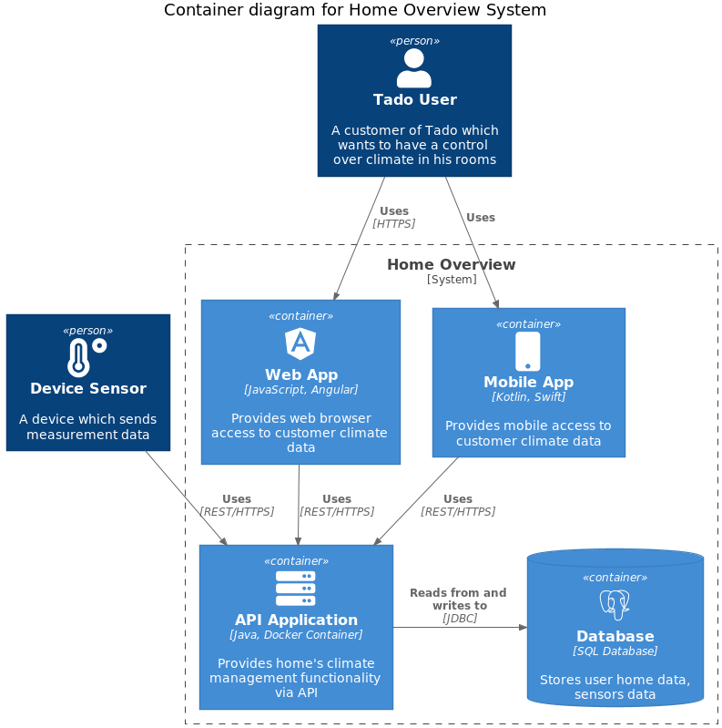
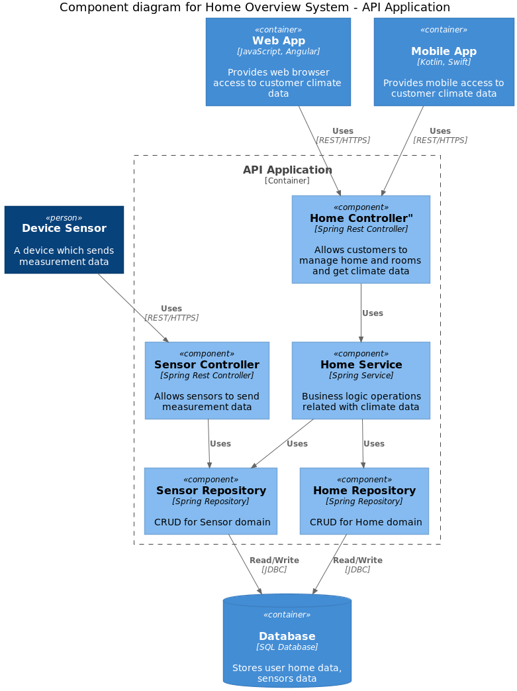

## Home overview prototype
The goal of this project is to provide a prototype for a backend application for home climate management.
User can define rooms and assigns sensors to them, to check the current climate in his home.  

[C4 Container Diagram](docs/c4/C4_ContainerDiagram_HomeOverview.puml)  


### Application architecture
Application follows Small Monolith approach to quickly validate the ideas and to reduce the time
needed for development of new user stories. After finalizing the main feature list, it can be refactored to
different architecture style if needed.

[C4 Component Diagram](docs/c4/C4_ComponentDiagram_HomeOverview.puml)  


### Application API
API interface was specified in OpenAPI Specification format. You can find it [here](api/src/main/resources/home-overview-api.yaml)

---

### Quickstart
Build project:

```bash
$ mvn clean install
```

Above command will package the application and prepare docker image `tado-home-overview-app:latest`  
Finally you can start containers by typing:

```bash
$ docker-compose -f home-overview-prototype.yaml up
```

It will start two containers:
- postgres - which is preconfigured PostgreSQL database, exposing port to 5432
- tado-app - Home overview application exposed on port 8080

You can play with application using for example Postman:

[Postman collection](docs/home-overview.postman_collection.json)  
[Postman environment](docs/ho-local.postman_environment.json)
